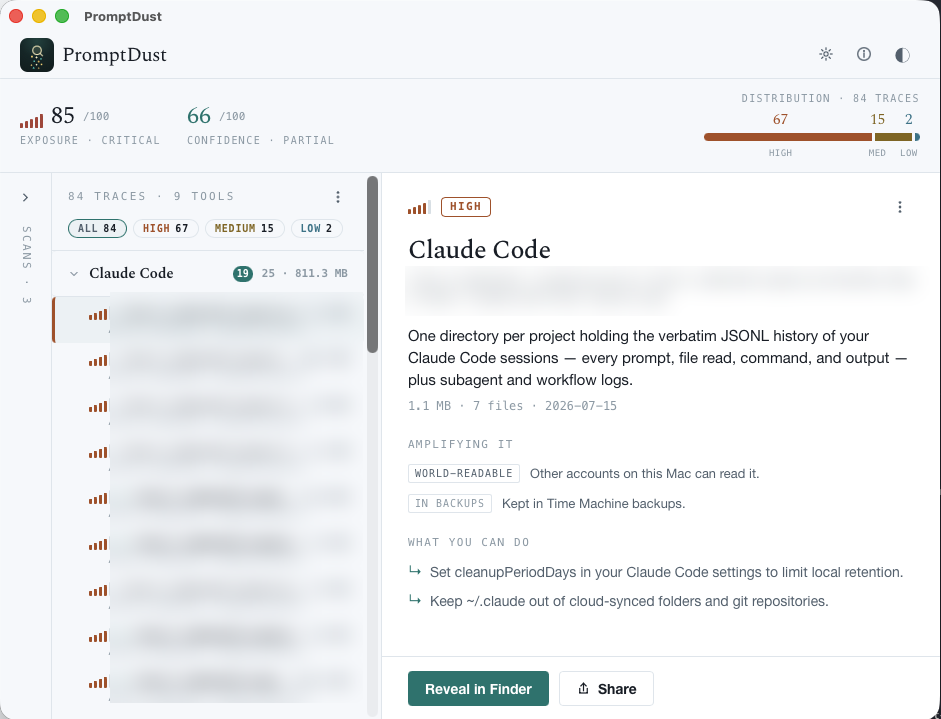

<div align="center">


# PromptDust

*The dust your prompts leave behind.*

[](https://github.com/promptdust/promptdust/actions/workflows/ci.yml)
[](https://github.com/promptdust/promptdust/releases/latest)
[](LICENSE)


</div>

> A small, read-only desktop and CLI tool that shows you **where AI tools have quietly
> stored your conversations, caches, and credentials on your own machine — and what is
> amplifying the exposure** (cloud sync, backups, git repos, world-readable permissions).

<div align="center">
  
</div>

**Status:** Beta, **v0.3.1**. The engine, CLI, and desktop app are built and tested end to
end (~96% line coverage on the engine + CLI), with CI running on macOS, Windows, and Linux.
Remaining before a signed 1.0.0: Developer ID / Windows code-signing certificates, so the
installers stop warning on first launch.

## What it is

Modern AI tools — Claude Code, Cursor, the ChatGPT and Claude desktop apps, GitHub Copilot,
Ollama, and many others — persist the *content* of your conversations to local disk, usually
in plaintext, in locations you never chose and mostly don't know about. PromptDust makes that
invisible footprint **visible**. It answers two questions: *what AI data is sitting on my
machine*, and *what is making it more exposed than it needs to be*. Out of the box it maps
**52 AI tools across 63 detection definitions** (definition DB `2026.07.5`) and degrades any
check it can't run on your OS to `unknown`, never a false answer.

It's an **inventory / footprint mapper**, not a "security scanner." It never modifies or
deletes anything, never reads message content, and sends nothing off your machine unless you
opt in.

### What it is NOT

- Not a **secret scanner** (Gitleaks/TruffleHog) — those match secrets inside files.
- Not a **DLP / egress tool** — those stop data going *to* the model.
- Not a **cleaner** — it never deletes.
- Not a **security score** — it never issues a pass/fail verdict.

It fills the open niche: a local, read-only, cross-tool **AI-data footprint mapper for
individuals**, with an exposure-amplifier analysis no existing tool provides.

## The four principles (non-negotiable)

1. **Read-only.** The tool never modifies, moves, or deletes a file. Ever.
2. **Local-only.** The scan makes zero network calls — nothing leaves the device during a
   scan. Anything the app ever sends is opt-in, off by default, and never carries content or
   anything that identifies you.
3. **Inventory, not a verdict.** It reports *what is there and why it might matter*. It never
   claims you are "secure" or "clean."
4. **Metadata-only.** It reports existence, size, timestamps, and structural facts. It does
   **not** read, print, or store the contents of your conversations.

## Why you can trust this

You're being asked to run an unfamiliar tool against sensitive folders. Here's why you don't
have to take our word for any of it:

- **Open.** Every line is Apache-2.0 and auditable — read it, or build it yourself.
- **Read-only and local-only by construction.** The no-network and no-verdict guarantees are
  enforced by CI guards and tests, not just claimed: the scan path (`promptdust-core`) has no
  networking crates anywhere in its dependency tree.
- **Verifiable builds.** Every release ships SHA-256 checksums, CycloneDX SBOMs, and SLSA
  build-provenance attestations, so you can confirm a download is exactly what this repo's
  workflow produced. See [Verify your download](#verify-your-download).
- **No telemetry by default.** Anonymous usage stats are off until you turn them on, and the
  app shows you the exact payload first. See [`docs/PRIVACY.md`](docs/PRIVACY.md) and
  [`docs/TELEMETRY.md`](docs/TELEMETRY.md).
- **Report privately.** Found a security issue? [`SECURITY.md`](SECURITY.md) tells you how.

## Install

Prebuilt binaries for macOS, Windows, and Linux are on the
[latest release](https://github.com/promptdust/promptdust/releases/latest).

| Platform | Desktop app | CLI |
|----------|-------------|-----|
| macOS 12+ (universal) | `PromptDust_*_universal.dmg` | `promptdust-macos` |
| Windows 10+ (x64) | `PromptDust_*_x64-setup.exe` / `.msi` | `promptdust-windows.exe` |
| Linux (Ubuntu 22.04+) | `.AppImage` / `.deb` / `.rpm` | `promptdust-linux` |

The CLI binaries are version-less, so their download links are permanent, e.g.
`releases/latest/download/promptdust-macos`. A Homebrew formula and a winget manifest are
authored; see [`docs/INSTALL.md`](docs/INSTALL.md) for their status.

> **The first-launch warning is expected.** Builds are unsigned for now, so macOS and Windows
> will warn that they can't verify the publisher. That means the OS can't confirm *who* built
> it, not that anything is wrong. [`docs/INSTALL.md`](docs/INSTALL.md) walks you through it —
> or verify the download cryptographically (below), or build from source.

### Build from source

```sh
cargo run --bin promptdust -- scan     # CLI, read-only
cd desktop && cargo tauri dev          # desktop app (needs tauri-cli)
```

## Verify your download

Don't take our word for it — confirm the release yourself (full walkthrough in
[`docs/INSTALL.md`](docs/INSTALL.md#verify-before-you-run-recommended)):

```sh
# 1. Bytes match what the release published:
shasum -a 256 -c SHA256SUMS                                   # macOS/Linux

# 2. Provenance — built by this repo's release workflow, not re-uploaded or tampered with:
gh attestation verify promptdust-macos --repo promptdust/promptdust

# 3. Contents — CycloneDX SBOMs (promptdust-*.cdx.json) enumerate every dependency.
```

## Usage

```sh
promptdust scan                 # human-readable table of what's on your machine
promptdust scan --json          # machine-readable, for scripting or diffing runs
promptdust scan --only cursor   # limit the scan to one tool
promptdust definitions list     # every AI tool PromptDust knows how to find
```

The desktop app wraps the same engine with a saved scan **Inbox**, attention filters, and a
persistent detail view. See [`docs/USER-GUIDE.md`](docs/USER-GUIDE.md).

## Security & privacy

- **Read-only, local-only, metadata-only** — enforced by CI guards, not just documented.
- **Zero network calls during a scan.** `promptdust-core` has no networking crates in its
  dependency tree, checked on every CI run.
- **Telemetry is opt-in and off by default.** You can preview the exact anonymous payload, and
  generate a redacted, path-free diagnostics bundle to inspect before sharing.
- Report a vulnerability privately via [`SECURITY.md`](SECURITY.md); full threat model in
  [`docs/PRIVACY.md`](docs/PRIVACY.md).

## Documentation

| Doc | Purpose |
|-----|---------|
| [`docs/INSTALL.md`](docs/INSTALL.md) | Install the desktop app and CLI on each OS, and verify a download. |
| [`docs/USER-GUIDE.md`](docs/USER-GUIDE.md) | Use the app/CLI and read the results. |
| [`docs/PRIVACY.md`](docs/PRIVACY.md) | Privacy statement and threat model. |
| [`docs/TELEMETRY.md`](docs/TELEMETRY.md) | What the opt-in, off-by-default telemetry does and does not send. |
| [`SECURITY.md`](SECURITY.md) | How to report a security issue. |
| [`LICENSING.md`](LICENSING.md) | The open-source boundary and licensing. |
| [`CHANGELOG.md`](CHANGELOG.md) | What changed in each release. |

## Contributing

PromptDust is open source so you can read and audit it, but it's developed in-house by the
PromptDust team and **outside code contributions are not accepted**. The one thing you can
contribute is **coverage**: tell it about an AI tool it doesn't map yet (or a wrong detail) by
opening an issue. Bug reports are welcome too. See [`CONTRIBUTING.md`](CONTRIBUTING.md).

## License

PromptDust is licensed under the [Apache License 2.0](LICENSE) (see also [`NOTICE`](NOTICE)).
The engine — `promptdust-core`, `promptdust-cli`, `promptdust-desktop` — and the bundled
definitions database are open-source under Apache-2.0, permanently. The open/private boundary
is documented in [`LICENSING.md`](LICENSING.md).
